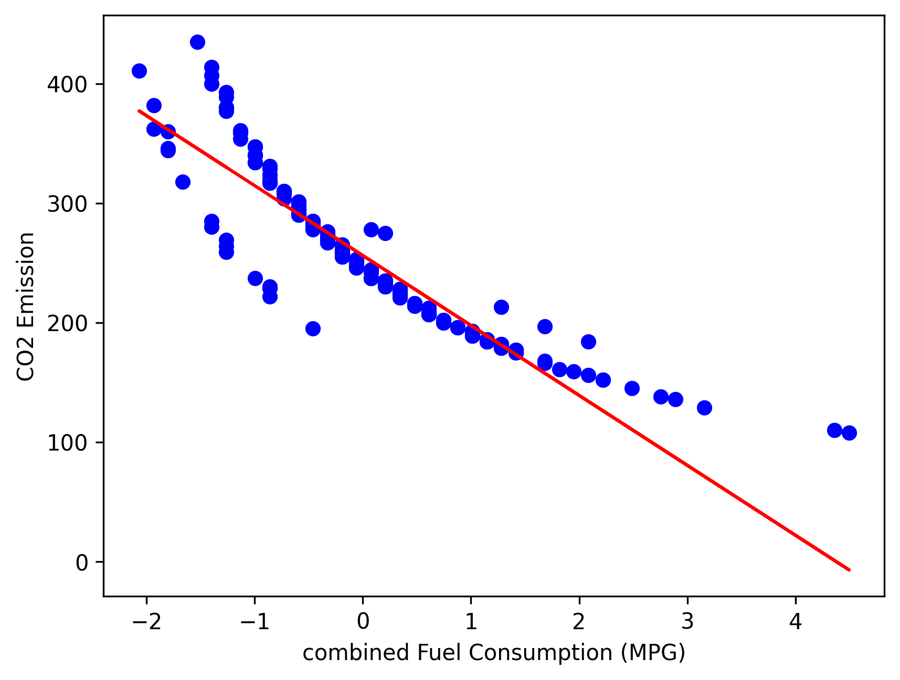

# 🚗 CO₂ Emission Predictor — Linear & Multiple Linear Regression

Can we quantify how much carbon a car emits just by knowing its engine size and fuel consumption?  
This project explores that question using **linear and multiple linear regression** —  
bridging simple mathematics with real-world environmental impact.

---

## 📊 Overview

- **Goal:** Predict CO₂ emissions based on vehicle features  
- **Techniques:** Linear Regression, Multiple Linear Regression  
- **Tools:** Python, scikit-learn, pandas, matplotlib  
- **Dataset:** `data.csv` (vehicle specifications and emission rates)

---

## 🧠 Workflow

1. **Data Loading & Cleaning**  
   Loaded the dataset, checked for missing values, and performed basic preprocessing.  

2. **Exploratory Data Analysis (EDA)**  
   Visualized relationships between engine size, fuel consumption, and emissions.  

3. **Model Development**  
   - Built a **simple linear regression** model for engine size vs. CO₂ emission  
   - Built a **multiple linear regression** model combining engine size and fuel consumption  

4. **Model Evaluation**  
   - Fitted regression lines and visualized their trends  
   - Interpreted how strongly each variable influences emission levels  

---

## 📈 Results

| Model | R² Score | Key Insight |
|--------|-----------|--------------|
| **Simple Linear Regression** | ~0.75 | Engine size alone explains most of the emission variance |
| **Multiple Linear Regression** | ~0.85 | Combining engine size and fuel consumption improves prediction accuracy |

---

### 🔹 Relationship Between Engine Size and Emission
Larger engines emit more CO₂ — a clear linear trend.  
The red line shows the regression fit between engine size and emission levels.

---

### 🔹 Relationship Between Fuel Consumption and Emission
Higher fuel consumption directly leads to higher emissions.  
A negative correlation with efficiency metrics (MPG) is visible.

---

### 🔹 Multiple Linear Regression Plane
The 3D plane below shows how **engine size** and **fuel consumption** together explain CO₂ emissions.

---

## 🔍 Inference

The regression models reveal a consistent truth —  
**as engine size and fuel use increase, CO₂ emissions rise proportionally.**

This experiment highlights how even basic ML techniques like regression can:  
- Model real environmental data effectively  
- Quantify relationships between engineering and climate impact  
- Provide interpretable insights for emission control strategies  

---

## ⚙️ Potential Extensions
- Add more predictors (vehicle weight, cylinders, model year)  
- Deploy the model with a small web interface  
- Compare linear regression vs. tree-based regression for non-linear effects  

---

## 🧩 Files

| File | Description |
|------|-------------|
| `Multiple_Linear_Regression.ipynb` | Jupyter Notebook with data analysis and regression models |
| `data/` | Dataset used for model training |
| `results/` | Visualization outputs (plots and regression planes) |
| `README.md` | This documentation file |

---

## 📘 Skills Highlighted

- Linear and Multiple Regression  
- Environmental Data Modeling  
- Data Visualization & Interpretation  
- Model Explainability and Performance Metrics  

---

📍 *A foundational step toward using ML to understand and reduce carbon footprints.*  
✍️ *Written by Rohith Roshan — with AI assistance.*
