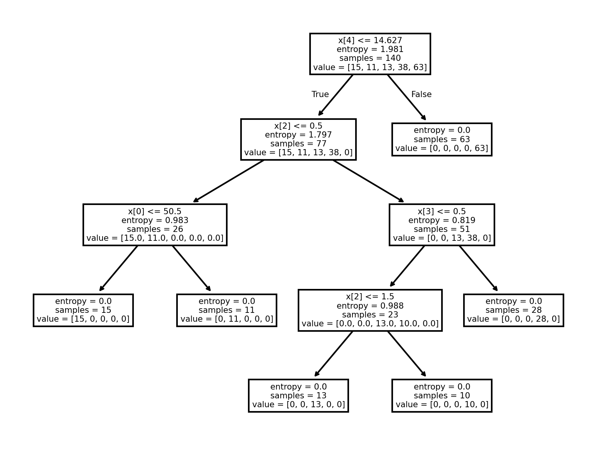

# 💊 Drug Prescription Classifier

Can we predict which drug a doctor should prescribe based on a patient’s health profile?  
This project explores that question using **Decision Tree Classification** — a simple yet powerful model that learns from medical attributes like blood pressure, cholesterol, age, and sodium-to-potassium ratio to determine the best medication.

---

## 📊 Overview

- **Goal:** Predict the drug type prescribed to a patient based on medical indicators  
- **Algorithm:** Decision Tree Classifier  
- **Tools:** Python, scikit-learn, pandas, matplotlib, seaborn  
- **Dataset:** `drug200.csv` (200 samples, 5 features + target)

---

## 🧠 Workflow

1. **Data Exploration & Cleaning**  
   - Dataset contained no missing values  
   - Encoded categorical features (e.g., Sex, BP, Cholesterol) using label encoding  

2. **EDA (Exploratory Data Analysis)**  
   The dataset shows how prescriptions vary across patients — some drugs are much more common than others.

   

   > **Observation:**  
   > - `drugY` dominates the prescriptions (≈45%)  
   > - `drugX` follows, while `drugA`, `drugB`, and `drugC` are prescribed less frequently  
   > - Implies certain patient conditions tend to align with `drugY`’s treatment profile

3. **Model Development**  
   - Split data into **train (70%)** and **test (30%)**  
   - Used **DecisionTreeClassifier** from scikit-learn with `criterion='entropy'`  
   - Trained on 5 features:
     - Age  
     - Sex  
     - Blood Pressure (BP)  
     - Cholesterol  
     - Na_to_K (Sodium-to-Potassium ratio)

4. **Model Visualization**  
   The trained decision tree clearly shows how health factors drive prescription outcomes:

   

   > **Interpretation:**  
   > - Sodium-to-Potassium ratio is the **most critical splitting feature**  
   > - High Na/K values often indicate patients suitable for `drugY`  
   > - Blood Pressure and Cholesterol levels refine the classification for other drugs  
   > - Age plays a minor but context-dependent role

---

## 📈 Results

| Metric | Value |
|--------|--------|
| **Accuracy** | ~98% |
| **Classifier Used** | Decision Tree (Entropy-based) |
| **Train/Test Split** | 70/30 |

> **Key Takeaway:**  
> Decision Trees are powerful for small medical datasets — they offer interpretability and high accuracy without complex preprocessing.

---

## 🔍 Inference

The model successfully identifies which drug to prescribe based on simple patient data.  
Its interpretability makes it ideal for clinical decision support systems, where transparency matters.

### 💡 Insights:
- **High Sodium-to-Potassium Ratio → Drug Y** (the dominant predictor)  
- **Normal BP & Low Cholesterol → Drug X / A**  
- **High BP & High Cholesterol → Drug C / B (less common)**  

### ⚙️ Limitations & Future Work
- Dataset is small (200 samples) — more diverse data could generalize results  
- Could compare with **Random Forest** or **Naïve Bayes** for robustness  
- Adding more medical variables (BMI, glucose, heart rate) could improve real-world accuracy

---

## 🧩 Files

| File | Description |
|------|-------------|
| `DecisionTree_Drug_Prescription_Classifier.ipynb` | Full notebook with model pipeline and visualization |
| `results/` | Output plots and decision tree visualization |
| `README.md` | This documentation file |

---

## 📘 Skills Highlighted

- Decision Tree Classification  
- Categorical Data Encoding  
- Model Visualization & Interpretability  
- Healthcare ML Application  

---

📍 *A small step toward intelligent and transparent medical recommendation systems.*  
✍️ *Written by Rohith Roshan — with AI assistance.*
